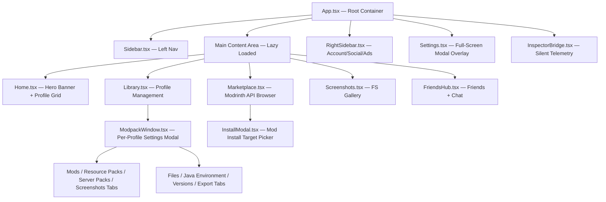
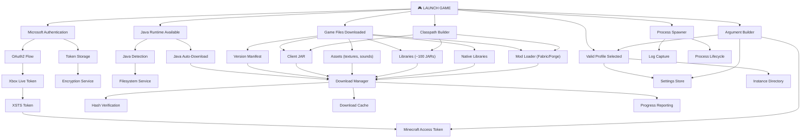
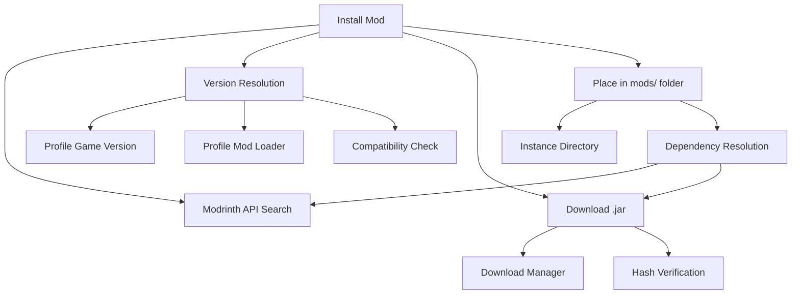
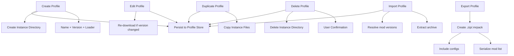
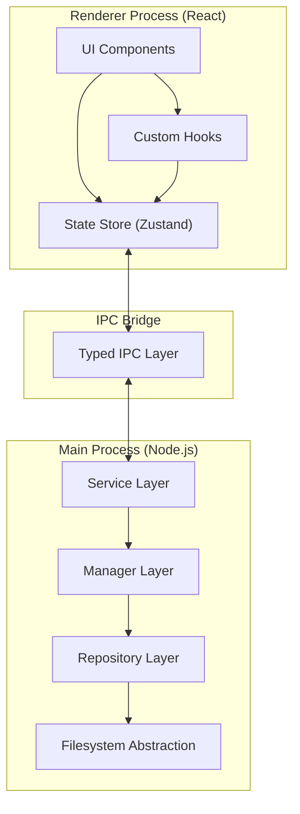
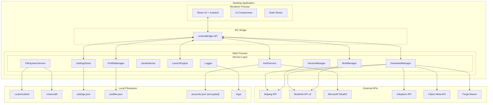
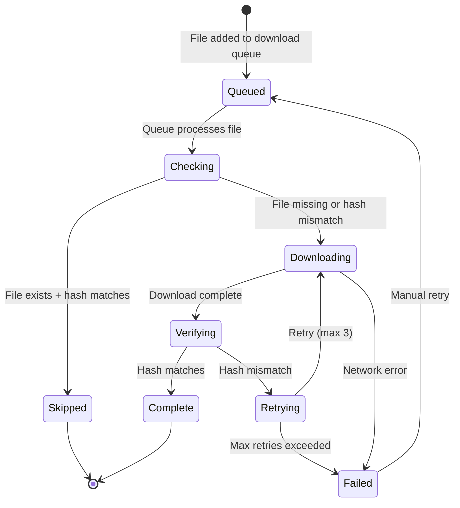
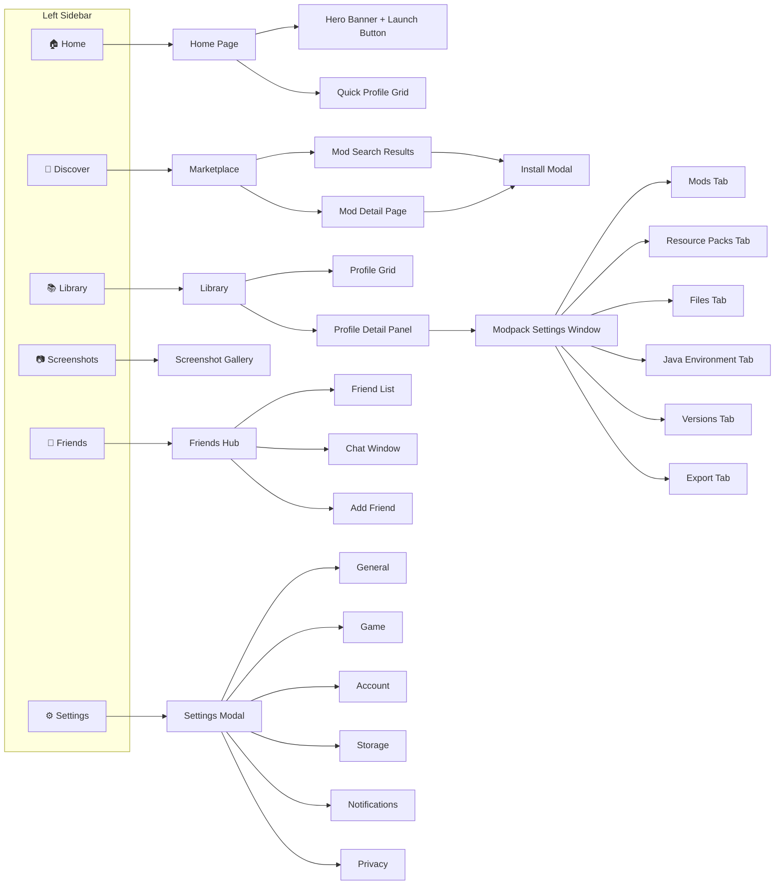

# Custom Client — Complete System Architecture Document

> **Author**: Senior Software Architect  
> **Date**: July 6, 2026  
> **Scope**: Full architectural analysis and design blueprint for a commercial-grade Minecraft launcher ecosystem

---

## TABLE OF CONTENTS

1. [Phase 1 — Current Project Analysis](#phase-1--current-project-analysis)
2. [Phase 2 — Feature Discovery](#phase-2--feature-discovery)
3. [Phase 3 — Dependency Mapping](#phase-3--dependency-mapping)
4. [Phase 4 — Architecture Improvements](#phase-4--architecture-improvements)
5. [Phase 5 — Roadmap](#phase-5--roadmap)
6. [Phase 6 — Visual Documentation](#phase-6--visual-documentation)
7. [Phase 7 — Risk Analysis](#phase-7--risk-analysis)
8. [Phase 8 — Implementation Strategy](#phase-8--implementation-strategy)

---

# PHASE 1 — Current Project Analysis

## 1.1 Project Identity

**Custom Client** is a Minecraft launcher/client ecosystem targeting version 1.19.xx+. The project aspires to be a **Lunar Client / Badlion Client / Prism Launcher competitor** with a unique marketplace and modular architecture. The ecosystem consists of four major subsystems:

| Subsystem | Status | Tech Stack |
|-----------|--------|------------|
| **Launcher** (Desktop App) | 🟡 UI-only shell (no launch logic) | Electron 43 + React 19 + Vite 8 + TypeScript |
| **Client Mod** (Fabric) | 🔴 Empty directory scaffold only | Java / Fabric / Gradle (planned) |
| **Editor Studio** | 🔴 Not started | Electron + React + Monaco Editor (planned) |
| **Backend / Marketplace** | 🔴 Empty directory scaffold only | Node.js / Express / MongoDB (planned) |

## 1.2 Current Architecture

### Folder Structure

```
Custom Client/
├── launcher/                        # ← Primary active development
│   ├── electron/
│   │   ├── main.cjs                 # Electron main process (163 lines)
│   │   └── preload.js               # Empty preload (4 lines, no IPC bridge)
│   ├── src/
│   │   ├── main.tsx                 # React entry point
│   │   ├── inspector.tsx            # Inspector window entry
│   │   ├── App.tsx                  # Root component (130 lines)
│   │   ├── InspectorApp.tsx         # Developer tools window (235 lines)
│   │   ├── InspectorBridge.tsx      # Telemetry bridge (121 lines)
│   │   ├── index.css                # Global styles + design system (409 lines)
│   │   ├── components/
│   │   │   ├── Home.tsx             # Landing page with hero + profile grid
│   │   │   ├── Sidebar.tsx          # Left navigation sidebar
│   │   │   ├── RightSidebar.tsx     # Account center + friends + ads
│   │   │   ├── Library.tsx          # Modpack/profile grid manager
│   │   │   ├── ModpackWindow.tsx    # Per-profile settings modal (364 lines)
│   │   │   ├── Marketplace.tsx      # Modrinth API browser (722 lines — LARGEST)
│   │   │   ├── InstallModal.tsx     # Mod install target picker
│   │   │   ├── Settings.tsx         # Global launcher settings (321 lines)
│   │   │   ├── Screenshots.tsx      # FS-backed screenshot gallery
│   │   │   └── FriendsHub.tsx       # Full friends + chat system
│   │   ├── hooks/
│   │   │   └── useLocalStorage.ts   # Generic localStorage hook
│   │   ├── utils/
│   │   │   └── defaultProfiles.ts   # Hardcoded default profile data
│   │   └── assets/
│   │       └── hero.png             # Hero banner image
│   ├── public/
│   │   ├── bg.png                   # Background image (1.8 MB)
│   │   ├── logo.png                 # App icon (1.4 MB)
│   │   ├── favicon.svg              # Browser tab icon
│   │   └── icons.svg                # Icon spritesheet
│   ├── package.json                 # Dependencies
│   ├── vite.config.ts               # Multi-entry Vite config
│   └── tsconfig.*.json              # TypeScript configs
├── client/                          # ← Minecraft Fabric mod (EMPTY SCAFFOLD)
│   └── src/main/
│       ├── java/com/customclient/
│       │   ├── api/                 # Empty
│       │   ├── core/                # Empty
│       │   ├── defaultmods/         # Empty
│       │   ├── scripting/           # Empty
│       │   └── ui/                  # Empty
│       └── resources/
│           ├── assets/customclient/ # Empty
│           └── default_scripts/     # Empty
├── backend/                         # ← Marketplace API (EMPTY SCAFFOLD)
│   └── src/
│       ├── models/                  # Empty
│       └── routes/                  # Empty
├── docs/                            # Empty
├── Main_Plan.md                     # Master plan document
├── ReadmefirstAi.md                 # AI development rules
├── TODO.md                          # Prioritized task list
├── CHANGELOG.md                     # 429-line development log
└── README.md                        # Project overview
```

### UI Structure



### Navigation Flow

| Sidebar Tab | Component | Route |
|------------|-----------|-------|
| Home | `Home.tsx` | `activeTab === 'home'` |
| Discover | `Marketplace.tsx` | `activeTab === 'discover'` |
| Library | `Library.tsx` | `activeTab === 'library'` |
| Screenshots | `Screenshots.tsx` | `activeTab === 'screenshots'` |
| Friends | `FriendsHub.tsx` | `activeTab === 'friends'` |
| Settings | `Settings.tsx` | `showSettings === true` (modal overlay) |

## 1.3 Existing Backend

**Status: Empty shell.** The `backend/src/` directory has empty `models/` and `routes/` folders. No server code, no database schema, no API endpoints exist.

## 1.4 Services & Managers

**There are NO service classes, managers, or business logic layers.** All logic lives directly inside React components as inline `useState`/`useEffect` hooks and event handlers.

| Concern | Current Location | Should Be |
|---------|-----------------|-----------|
| Profile management | Scattered across `Home.tsx`, `Library.tsx`, `InstallModal.tsx`, `defaultProfiles.ts` | `ProfileService` |
| Marketplace API calls | Inline `fetch()` in `Marketplace.tsx` | `ModrinthApiService` |
| Installed mods tracking | Raw `localStorage` in `Marketplace.tsx`, `ModpackWindow.tsx` | `ModManager` |
| Settings persistence | `useLocalStorage` hook, scattered across components | `SettingsStore` |
| Screenshot filesystem | Direct `fs` calls in `Screenshots.tsx` | `FileSystemService` |
| Telemetry collection | `InspectorBridge.tsx` | `TelemetryService` |

## 1.5 ViewModels / Controllers

**None exist.** The project follows a flat component architecture with no ViewModel, Controller, or Presenter layer. All state is local `useState` or `useLocalStorage`, with no centralized state management (no Context, Redux, Zustand, or any state library).

## 1.6 API Layers

| API | Status | Notes |
|-----|--------|-------|
| **Modrinth API v2** | ✅ Integrated (read-only) | Used in `Marketplace.tsx` for search, details, game versions |
| **mc-heads.net** | ✅ Integrated | Player avatar/head rendering in `RightSidebar.tsx` |
| **minotar.net** | ✅ Integrated | Player skin rendering in `Settings.tsx` |
| **Electron IPC** | 🟡 Partial | Inspector bridge only. No file dialogs, no auth, no launch IPC |
| **Microsoft OAuth** | 🔴 Not implemented | UI placeholder exists but no auth flow |
| **Custom Backend** | 🔴 Not implemented | Empty directories |

## 1.7 Utilities

| Utility | File | Purpose |
|---------|------|---------|
| `useLocalStorage` | `hooks/useLocalStorage.ts` | Generic hook for persisting state to localStorage with JSON serialization |
| `generatePlaceholder` | `utils/defaultProfiles.ts` | Generates inline SVG "WIP" placeholder images |
| `defaultProfiles` | `utils/defaultProfiles.ts` | Hardcoded array of 5 demo profiles |
| `getPlayerAvatar` | `components/RightSidebar.tsx` | Utility function (incorrectly co-located with a component) |

## 1.8 Assets

| Asset | Location | Size | Purpose |
|-------|----------|------|---------|
| `bg.png` | `public/` | 1.87 MB | Main background image |
| `logo.png` | `public/` | 1.44 MB | Application icon |
| `favicon.svg` | `public/` | 9.5 KB | Browser/tab favicon |
| `icons.svg` | `public/` | 5.0 KB | Icon spritesheet |
| `hero.png` | `src/assets/` | 13 KB | Hero banner (unused — `bg.png` is used instead) |

> [!WARNING]
> Both `bg.png` (1.87 MB) and `logo.png` (1.44 MB) are extremely oversized for production. They should be compressed or converted to WebP.

## 1.9 Configuration System

| Configuration | Storage | Scope |
|--------------|---------|-------|
| Performance mode | `localStorage('performanceMode')` | Global |
| Cursor theme | `localStorage('cursorTheme')` | Global |
| Launch behavior | `localStorage('settings_launchBehavior')` | Global |
| Language | `localStorage('settings_language')` | Global |
| Allocated memory | `localStorage('settings_allocatedMemory')` | Global |
| Resolution (X/Y) | `localStorage('settings_resX/Y')` | Global |
| JVM arguments | `localStorage('settings_jvmArgs')` | Global |
| Java path (per-profile) | `localStorage('java_path_{id}')` | Per-profile |
| JVM args (per-profile) | `localStorage('jvm_args_{id}')` | Per-profile |
| MC version (per-profile) | `localStorage('mc_version_{id}')` | Per-profile |
| Mod loader (per-profile) | `localStorage('mod_loader_{id}')` | Per-profile |
| Installed mods | `localStorage('installedMods')` | Global (⚠️ should be per-profile) |
| Profiles list | `localStorage('launcher_profiles')` | Global |

> [!CAUTION]
> **All configuration is in `localStorage`.** This is browser-scoped, volatile, and will be wiped if the user clears Electron cache. For a commercial launcher, this MUST migrate to file-based storage (JSON files on disk via Electron's `app.getPath('userData')`).

## 1.10 Existing Launch Flow

**There is NO launch flow.** The "LAUNCH GAME" button exists in the UI in two places:
1. [Home.tsx](file:///e:/Custom Client/launcher/src/components/Home.tsx) — Hero banner
2. [Library.tsx](file:///e:/Custom Client/launcher/src/components/Library.tsx) — Selected profile panel

Both buttons are **non-functional** — they have no `onClick` handler that spawns a Java process.

## 1.11 Existing Profile System

Profiles are **hardcoded demo data** in [defaultProfiles.ts](file:///e:/Custom Client/launcher/src/utils/defaultProfiles.ts). The `Library.tsx` component reads from `localStorage` (seeded with defaults). Profile creation, deletion, and editing are not wired up.

Each profile has: `id`, `title`, `name`, `author`, `version`, `loader`, `desc`, `bg`, `icon`.

**Missing profile fields**: Game directory, mods list, resource packs, shader packs, JVM arguments, Java path, window resolution, last played, play time, creation date.

## 1.12 Authentication

**Not implemented.** The UI shows a hardcoded "Atyachari" username with a static avatar. The "Add Account" and "Sign In" buttons exist but do nothing. Microsoft OAuth2 flow is planned but has zero implementation.

## 1.13 Theme System

The design system lives in [index.css](file:///e:/Custom Client/launcher/src/index.css) with CSS custom properties:

- **Colors**: `--accent-primary` (#a855f7 purple), `--bg-app`, `--bg-sidebar`, `--bg-card`, `--text-primary`, `--text-secondary`
- **Glassmorphism**: `.glass` class with `backdrop-filter: blur(40px)`
- **Animations**: `blob-pink`, `blob-green` floating gradients; `fadeIn`, `slideUpFade`, `scaleInFade`
- **Performance Mode**: `body.performance-mode` disables all animations, shadows, and blur

> [!NOTE]
> There is no runtime theme switching beyond performance mode. The "global theme/color customizer" is listed as a Phase 4 future feature in TODO.md.

## 1.14 State Management

**No centralized state management.** State is distributed across components via:
- `useState` — Local ephemeral state
- `useLocalStorage` — Persisted key-value pairs
- `Raw localStorage` — Direct `localStorage.getItem/setItem` calls (bypassing React state)

**There is no shared state mechanism** — no React Context, no store library, no event bus. This causes:
- ⚠️ Profile data is duplicated between `Home.tsx` and `Library.tsx`
- ⚠️ Installed mods list is read independently in multiple components
- ⚠️ Settings don't propagate to other windows

## 1.15 Download System

**Not implemented.** No Minecraft version manifest fetching, no asset downloading, no library downloading, no native extraction.

## 1.16 Caching

**Not implemented.** The only "cache" is `localStorage` for settings and a raw `localStorage` array for installed mod IDs.

## 1.17 Logging

Logging is **console-only** with an IPC relay to the Inspector window:

```
console.log/warn/error → intercepted in App.tsx → ipcRenderer.send('relay-log') → Inspector window
```

There is no file-based logging, no structured logging, no log rotation.

## 1.18 Dependency Graph (npm)

| Dependency | Version | Purpose |
|-----------|---------|---------|
| `react` | 19.2.7 | UI framework |
| `react-dom` | 19.2.7 | DOM rendering |
| `lucide-react` | 1.23.0 | Icon library |
| `@tanstack/react-virtual` | 3.14.5 | Virtual scrolling (Marketplace list) |
| `electron` | 43.0.0 | Desktop shell (dev) |
| `electron-builder` | 26.15.3 | Packaging (dev) |
| `vite` | 8.1.1 | Build tool (dev) |
| `@vitejs/plugin-react` | 6.0.3 | React HMR (dev) |
| `typescript` | 6.0.2 | Type checking (dev) |
| `concurrently` | 10.0.3 | Dev script runner |
| `cross-env` | 10.1.0 | Cross-platform env vars |
| `wait-on` | 9.0.10 | Port readiness checker |
| `oxlint` | 1.71.0 | Linter |

> [!IMPORTANT]
> Notable **missing dependencies** for a Minecraft launcher: No HTTP client library (using raw `fetch`), no authentication library, no file compression/extraction library, no child process wrapper, no logging library, no state management library.

---

# PHASE 2 — Feature Discovery

## 2.1 Complete Feature Inventory

Below is every feature that will eventually interact with Minecraft launching, discovered from the codebase, TODO.md, Main_Plan.md, and ReadmefirstAi.md.

### Core Launcher Features

| # | Feature | Connection to Launching | Status |
|---|---------|------------------------|--------|
| 1 | **Minecraft Version Management** | Must download correct version manifest, client JAR, and assets index for the target version | 🔴 Not started |
| 2 | **Version Manifest Fetching** | Mojang's `version_manifest_v2.json` → select version → download `{version}.json` | 🔴 Not started |
| 3 | **Assets Downloading** | The game requires `assets/` directory with textures, sounds, languages indexed by hash | 🔴 Not started |
| 4 | **Libraries Downloading** | Each version specifies ~40-120 JAR libraries that must be on the classpath | 🔴 Not started |
| 5 | **Native Extraction** | Platform-specific native libraries (LWJGL, OpenAL) must be extracted to a `natives/` directory | 🔴 Not started |
| 6 | **Fabric Loader Installation** | Must download Fabric loader JAR + intermediary mappings + Fabric API | 🔴 Not started |
| 7 | **Forge Loader Installation** | Must run Forge installer, process patched client JAR | 🔴 Not started |
| 8 | **NeoForge Installation** | Fork of Forge with different artifacts, same installation concept | 🔴 Not started |
| 9 | **Quilt Loader Installation** | Quilt meta API for loader versions, similar to Fabric | 🔴 Not started |
| 10 | **Java Runtime Detection** | Scan system for installed JREs/JDKs, validate version compatibility | 🔴 Not started |
| 11 | **Java Runtime Download** | Auto-download Adoptium/Eclipse Temurin JRE if not found | 🔴 Not started |
| 12 | **Launch Process Spawning** | Construct classpath, main class, game arguments; spawn `java` child process | 🔴 Not started |
| 13 | **Launch Arguments Construction** | Build the full command line: JVM args + classpath + main class + game args + auth tokens | 🔴 Not started |
| 14 | **RAM Allocation** | `-Xmx{n}G` JVM argument from settings slider | 🟡 UI exists, not wired |
| 15 | **JVM Arguments** | Custom JVM flags (G1GC, experimental options) | 🟡 UI exists, not wired |
| 16 | **Window Resolution** | `--width` and `--height` game arguments | 🟡 UI exists, not wired |
| 17 | **Game Directory** | `--gameDir` argument pointing to instance-specific folder | 🟡 UI exists, not wired |

### Authentication Features

| # | Feature | Connection to Launching | Status |
|---|---------|------------------------|--------|
| 18 | **Microsoft OAuth2 Authentication** | Required to obtain Xbox Live token → XSTS token → Minecraft access token | 🔴 Not started |
| 19 | **Xbox Live Token Exchange** | Part of the Microsoft auth chain | 🔴 Not started |
| 20 | **XSTS Token Exchange** | Part of the Microsoft auth chain | 🔴 Not started |
| 21 | **Minecraft Services Authentication** | Exchange XSTS for Minecraft bearer token + UUID | 🔴 Not started |
| 22 | **Token Refresh** | Access tokens expire; must refresh without re-login | 🔴 Not started |
| 23 | **Multi-Account Support** | Switch between accounts without re-authenticating | 🔴 Not started |
| 24 | **Offline Mode** | Launch with a fake/offline UUID and username (no server joining) | 🔴 Not started |
| 25 | **Account Persistence** | Store encrypted tokens on disk | 🔴 Not started |

### Profile / Instance Management

| # | Feature | Connection to Launching | Status |
|---|---------|------------------------|--------|
| 26 | **Profile Creation** | Create a new launch configuration with version + loader + mods | 🟡 UI button exists, not wired |
| 27 | **Profile Editing** | Modify version, loader, JVM args, game directory | 🟡 UI exists in ModpackWindow |
| 28 | **Profile Deletion** | Remove profile and optionally its game files | 🔴 Not started |
| 29 | **Profile Duplication** | Clone a profile with all its mods/settings | 🔴 Not started |
| 30 | **Instance Isolation** | Each profile gets its own `.minecraft`-like directory | 🔴 Not started |
| 31 | **Profile Import** | Import profiles from `.zip` or `.mrpack` | 🔴 Not started |
| 32 | **Profile Export** | Export profile as shareable archive | 🟡 UI exists, not wired |

### Mod / Content Management

| # | Feature | Connection to Launching | Status |
|---|---------|------------------------|--------|
| 33 | **Mod Search & Discovery** | Browse Modrinth API for compatible mods | ✅ Implemented |
| 34 | **Mod Installation** | Download `.jar` to profile's `mods/` folder | 🟡 UI exists, only saves ID to localStorage |
| 35 | **Mod Removal** | Delete mod JAR from `mods/` folder | 🟡 UI exists, only removes from localStorage |
| 36 | **Mod Version Resolution** | Match mod version to game version + loader | 🔴 Not started |
| 37 | **Mod Dependency Resolution** | Auto-install required library mods | 🔴 Not started |
| 38 | **Mod Update Checking** | Compare installed vs latest available version | 🔴 Not started |
| 39 | **Resource Pack Management** | List, add, remove resource packs from `resourcepacks/` | 🟡 Empty UI placeholder |
| 40 | **Shader Pack Management** | List, add, remove shader packs | 🟡 Marketplace tab exists |
| 41 | **World Management** | List, backup, restore worlds from `saves/` | 🔴 Not started |
| 42 | **Server Pack Management** | Download and apply server-side resource packs | 🟡 Empty UI placeholder |

### Filesystem & Storage

| # | Feature | Connection to Launching | Status |
|---|---------|------------------------|--------|
| 43 | **Screenshot Gallery** | Read `.png` files from `.minecraft/screenshots/` | ✅ Implemented (node `fs`) |
| 44 | **Screenshot Actions** | Download, copy-to-clipboard, delete | ✅ Implemented |
| 45 | **Game Directory Selection** | Choose custom instance directory via Electron dialog | 🟡 UI exists, dialog not wired |
| 46 | **File Verification / Repair** | Hash-check installed files against expected checksums | 🔴 Not started |
| 47 | **Storage Management / Cache** | Track and clear downloaded assets/libraries | 🟡 UI exists, not wired |
| 48 | **Installation Directory Config** | Configure where `.customclient/` lives | 🟡 UI exists, not wired |

### Social Features

| # | Feature | Connection to Launching | Status |
|---|---------|------------------------|--------|
| 49 | **Friends List** | Display online/offline friends | ✅ Implemented (mock data) |
| 50 | **Direct Messaging / Chat** | Send messages to friends | ✅ Implemented (local-only mock) |
| 51 | **Friend Requests** | Send/accept/decline requests | 🟡 UI exists, not wired |
| 52 | **Block/Unblock Users** | Block users from messaging | 🟡 UI exists, local-only |
| 53 | **Discord Rich Presence** | Show game status on Discord | 🟡 UI toggle exists, not wired |
| 54 | **Player Avatars** | Render Minecraft heads/skins | ✅ Via mc-heads.net |

### Diagnostics & Developer Tools

| # | Feature | Connection to Launching | Status |
|---|---------|------------------------|--------|
| 55 | **Developer Options Window** | Separate Electron window with performance monitoring | ✅ Implemented |
| 56 | **FPS / Frame Time Telemetry** | Real-time FPS counter and graph | ✅ Implemented |
| 57 | **Hardware Info** | Display CPU, GPU, RAM, OS | ✅ Implemented |
| 58 | **DOM Statistics** | Track node count, visible/hidden elements | ✅ Implemented |
| 59 | **Feature Toggles** | Disable blur/animations/shadows remotely | ✅ Implemented |
| 60 | **Console / Log Viewer** | View game stdout/stderr in launcher | 🔴 Not started |
| 61 | **Crash Report Viewer** | Parse and display crash logs | 🔴 Not started |

### Platform & Distribution

| # | Feature | Connection to Launching | Status |
|---|---------|------------------------|--------|
| 62 | **Auto-Updater** | Check for and apply launcher updates | 🔴 Not started |
| 63 | **Telemetry & Crash Reports** | Send anonymous usage data | 🟡 UI toggle exists, no backend |
| 64 | **News Feed** | Display launcher news/announcements | 🔴 Not started |
| 65 | **Cosmetics System** | In-game cosmetic overlays (capes, hats) | 🔴 Not started |
| 66 | **Marketplace (Custom)** | Buy/sell themes and modules | 🔴 Not started (Modrinth bridge exists) |
| 67 | **Cloud Sync** | Sync profiles/settings across devices | 🔴 Not started |
| 68 | **Backups** | Backup and restore game data | 🔴 Not started |
| 69 | **Plugin System** | Third-party extensions for the launcher | 🔴 Not started |
| 70 | **Theme Customizer** | User-customizable launcher colors/themes | 🔴 Not started |

### Minecraft Client Mod (In-Game)

| # | Feature | Connection to Launching | Status |
|---|---------|------------------------|--------|
| 71 | **CEF Integration** | Overlay HTML/CSS UI over Minecraft | 🔴 Not started |
| 72 | **Dynamic Java Module Engine** | Runtime Java compilation for HUD mods | 🔴 Not started |
| 73 | **JavaScript/Lua Scripting** | UI scripting for menus and themes | 🔴 Not started |
| 74 | **Custom Main Menu** | Replace Minecraft main menu via CEF | 🔴 Not started |
| 75 | **Default Mods** | FPS display, CPS, Keystrokes | 🔴 Not started |
| 76 | **In-Game Event Bus** | Tick, Render events for module subscriptions | 🔴 Not started |

---

# PHASE 3 — Dependency Mapping

## 3.1 Critical Dependency Chains

### Chain 1: Launching Minecraft (The Golden Path)



### Chain 2: Mod Installation



### Chain 3: Profile Lifecycle



## 3.2 Bottleneck Identification

| Bottleneck | Impact | Severity |
|-----------|--------|----------|
| **No Download Manager** | Every download feature (versions, assets, libraries, mods, Java) is blocked | 🔴 Critical |
| **No Authentication Service** | Cannot launch online, cannot verify game ownership | 🔴 Critical |
| **No Filesystem Abstraction** | Every file operation requires reimplementing `fs` access patterns | 🔴 Critical |
| **No IPC Bridge** | Renderer process cannot communicate with Node.js APIs for file operations | 🔴 Critical |
| **No State Management** | Adding any cross-component feature requires refactoring state everywhere | 🟡 High |
| **No Process Manager** | Cannot spawn Java, cannot capture logs, cannot manage game lifecycle | 🔴 Critical |

## 3.3 Circular Dependency Risks

| Risk | Components | Issue |
|------|-----------|-------|
| Mods ↔ Profiles | `Marketplace.tsx` ↔ `Library.tsx` | Both read/write `installedMods` from `localStorage` independently. Installing a mod doesn't update the profile view without a page refresh. |
| Settings ↔ Launch | `Settings.tsx` writes to localStorage, Launch process needs to read those settings | No shared interface; settings keys are strings scattered across components |

## 3.4 Scalability Issues

1. **localStorage will not scale.** With 50+ profiles, each with 100+ mods, localStorage will hit its ~5-10 MB limit.
2. **Single-file CSS** will become unmaintainable beyond ~1000 lines. Need CSS modules or component-scoped styles.
3. **722-line Marketplace.tsx** is already a maintenance burden. It contains search logic, API calls, state management, UI rendering, and sub-views all in one file.
4. **No pagination for profiles** — rendering 100+ profiles will cause performance issues.

---

# PHASE 4 — Architecture Improvements

## 4.1 Proposed Architecture



## 4.2 Recommended Folder Structure

```
launcher/
├── electron/
│   ├── main.ts                          # Electron bootstrap
│   ├── preload.ts                       # contextBridge API exposure
│   ├── ipc/
│   │   ├── ipc-handlers.ts             # IPC handler registration
│   │   ├── ipc-channels.ts             # Typed channel constants
│   │   └── handlers/
│   │       ├── auth.handler.ts          # Auth IPC endpoints
│   │       ├── launch.handler.ts        # Launch IPC endpoints
│   │       ├── download.handler.ts      # Download IPC endpoints
│   │       ├── filesystem.handler.ts    # FS operation endpoints
│   │       └── settings.handler.ts      # Settings IPC endpoints
│   ├── services/
│   │   ├── auth/
│   │   │   ├── MicrosoftAuthService.ts  # OAuth2 + XSTS flow
│   │   │   ├── TokenStore.ts            # Encrypted token persistence
│   │   │   └── AuthTypes.ts             # Auth interfaces
│   │   ├── download/
│   │   │   ├── DownloadManager.ts       # Queue, retry, progress tracking
│   │   │   ├── HashVerifier.ts          # SHA1/SHA256 file integrity
│   │   │   └── DownloadTypes.ts         # Download interfaces
│   │   ├── minecraft/
│   │   │   ├── VersionManager.ts        # Mojang manifest, version resolution
│   │   │   ├── AssetManager.ts          # Asset index + object downloading
│   │   │   ├── LibraryManager.ts        # Library downloading + native extraction
│   │   │   ├── ClasspathBuilder.ts      # Build launch classpath
│   │   │   ├── ArgumentBuilder.ts       # Build JVM + game arguments
│   │   │   └── MinecraftTypes.ts        # Minecraft data interfaces
│   │   ├── loader/
│   │   │   ├── LoaderService.ts         # Abstract loader interface
│   │   │   ├── FabricLoader.ts          # Fabric meta API + installer
│   │   │   ├── ForgeLoader.ts           # Forge installer
│   │   │   ├── NeoForgeLoader.ts        # NeoForge installer
│   │   │   ├── QuiltLoader.ts           # Quilt meta API + installer
│   │   │   └── LoaderTypes.ts           # Loader interfaces
│   │   ├── java/
│   │   │   ├── JavaDetector.ts          # Scan system for Java installations
│   │   │   ├── JavaDownloader.ts        # Download Adoptium JRE
│   │   │   └── JavaTypes.ts             # Java interfaces
│   │   ├── launch/
│   │   │   ├── LaunchEngine.ts          # Orchestrator: prepare → launch → monitor
│   │   │   ├── ProcessManager.ts        # Spawn, kill, monitor child processes
│   │   │   └── LaunchTypes.ts           # Launch interfaces
│   │   ├── profile/
│   │   │   ├── ProfileManager.ts        # CRUD operations for profiles
│   │   │   ├── InstanceManager.ts       # Instance directory management
│   │   │   └── ProfileTypes.ts          # Profile interfaces
│   │   ├── mod/
│   │   │   ├── ModManager.ts            # Install, remove, update mods
│   │   │   ├── ModResolver.ts           # Version + dependency resolution
│   │   │   └── ModTypes.ts              # Mod interfaces
│   │   ├── filesystem/
│   │   │   ├── FileSystemService.ts     # Abstracted fs operations
│   │   │   ├── PathResolver.ts          # Platform-specific path resolution
│   │   │   └── FileTypes.ts             # File interfaces
│   │   └── config/
│   │       ├── SettingsStore.ts         # JSON file-based settings
│   │       └── SettingsTypes.ts         # Settings interfaces
│   ├── utils/
│   │   ├── logger.ts                    # Structured file + console logger
│   │   ├── crypto.ts                    # Token encryption helpers
│   │   └── platform.ts                  # OS detection helpers
│   └── events/
│       └── EventBus.ts                  # Node.js EventEmitter-based bus
├── src/
│   ├── main.tsx                         # React entry
│   ├── App.tsx                          # Root layout
│   ├── store/
│   │   ├── useProfileStore.ts           # Zustand profile state
│   │   ├── useAuthStore.ts              # Zustand auth state
│   │   ├── useSettingsStore.ts          # Zustand settings state
│   │   ├── useDownloadStore.ts          # Zustand download progress
│   │   └── useLaunchStore.ts            # Zustand launch state
│   ├── hooks/
│   │   ├── useIPC.ts                    # Typed IPC communication hook
│   │   ├── useLocalStorage.ts           # Existing hook
│   │   ├── useProfiles.ts              # Profile operations hook
│   │   └── useLaunch.ts                # Launch operations hook
│   ├── components/
│   │   ├── layout/
│   │   │   ├── Sidebar.tsx
│   │   │   ├── RightSidebar.tsx
│   │   │   └── TitleBar.tsx
│   │   ├── home/
│   │   │   ├── Home.tsx
│   │   │   └── HeroBanner.tsx
│   │   ├── library/
│   │   │   ├── Library.tsx
│   │   │   ├── ProfileCard.tsx
│   │   │   ├── ProfileDetails.tsx
│   │   │   └── CreateProfileModal.tsx
│   │   ├── marketplace/
│   │   │   ├── Marketplace.tsx
│   │   │   ├── ModCard.tsx
│   │   │   ├── ModDetails.tsx
│   │   │   ├── InstallModal.tsx
│   │   │   └── FilterSidebar.tsx
│   │   ├── settings/
│   │   │   ├── Settings.tsx
│   │   │   ├── GeneralSettings.tsx
│   │   │   ├── GameSettings.tsx
│   │   │   ├── AccountSettings.tsx
│   │   │   └── StorageSettings.tsx
│   │   ├── modpack/
│   │   │   ├── ModpackWindow.tsx
│   │   │   ├── ModsTab.tsx
│   │   │   ├── ResourcePacksTab.tsx
│   │   │   ├── JavaEnvironmentTab.tsx
│   │   │   └── VersionsTab.tsx
│   │   ├── social/
│   │   │   ├── FriendsHub.tsx
│   │   │   ├── FriendCard.tsx
│   │   │   └── ChatWindow.tsx
│   │   ├── screenshots/
│   │   │   ├── Screenshots.tsx
│   │   │   └── ScreenshotCard.tsx
│   │   ├── launch/
│   │   │   ├── LaunchButton.tsx
│   │   │   ├── LaunchProgress.tsx
│   │   │   └── ConsoleViewer.tsx
│   │   └── common/
│   │       ├── CustomDropdown.tsx
│   │       ├── ProgressBar.tsx
│   │       ├── Toast.tsx
│   │       ├── Modal.tsx
│   │       └── EmptyState.tsx
│   ├── styles/
│   │   ├── index.css
│   │   ├── variables.css
│   │   ├── animations.css
│   │   └── components.css
│   └── types/
│       ├── profile.ts
│       ├── minecraft.ts
│       ├── auth.ts
│       └── ipc.ts
```

## 4.3 Key Architecture Recommendations

### 4.3.1 IPC Bridge (Critical)

**Why**: Currently `contextIsolation: false` and `nodeIntegration: true` — this is a **severe security vulnerability**. Any XSS or loaded remote content can execute arbitrary Node.js code.

**Recommendation**: Enable `contextIsolation: true`, disable `nodeIntegration`, implement a typed `contextBridge` in `preload.ts` that exposes only the specific APIs needed.

### 4.3.2 State Management (Zustand)

**Why**: No shared state exists. As features grow, prop drilling and localStorage fragmentation will make the app unmaintainable.

**Recommendation**: Zustand — lightweight, TypeScript-first, no boilerplate. Create one store per domain (profiles, auth, settings, downloads, launch state).

### 4.3.3 Service Layer in Main Process

**Why**: All filesystem, network, and process operations MUST run in the Electron main process (or a utility process). The renderer should never directly access `fs`, `child_process`, or `os`.

**Recommendation**: Build a clean service layer in the main process, communicate via typed IPC channels.

### 4.3.4 Download Manager

**Why**: Every launcher feature depends on downloading files: game JARs, assets, libraries, mods, Java runtimes, updates.

**Recommendation**: A queue-based download manager with:
- Concurrent download limiting (max 5 simultaneous)
- SHA1/SHA256 hash verification
- Resume support for large files
- Progress callbacks per-file and aggregate
- Retry logic with exponential backoff
- Cache management (don't re-download if hash matches)

### 4.3.5 Event Bus

**Why**: Launch lifecycle, download progress, auth state changes, and mod installations all need to notify multiple consumers.

**Recommendation**: Node.js `EventEmitter` in main process, mirrored to renderer via IPC. Typed events with discriminated unions.

### 4.3.6 Structured Logging

**Why**: When users report crashes, console.log is useless. Need persistent, structured logs.

**Recommendation**: File-based logger with rotation (e.g., `electron-log` or custom using `winston`). Log to `{userData}/logs/launcher-{date}.log`.

### 4.3.7 Configuration Migration

**Why**: `localStorage` is unreliable, size-limited, and can't be accessed from the main process.

**Recommendation**: JSON files in `app.getPath('userData')`:
- `settings.json` — Global launcher settings
- `profiles.json` — Profile metadata
- `accounts.json` — Encrypted account tokens
- `{profileId}/profile.json` — Per-instance config

---

# PHASE 5 — Roadmap

## Phase 1: Foundation (Weeks 1-2)

**Objectives**: Establish the core infrastructure every future feature depends on.

| Task | Complexity | Dependencies |
|------|-----------|--------------|
| Enable `contextIsolation` + typed `contextBridge` preload | Medium | None |
| Implement IPC channel system with TypeScript types | Medium | Preload |
| Create `FileSystemService` for all file operations | Medium | IPC |
| Create `PathResolver` for platform-specific paths | Low | None |
| Implement `SettingsStore` (JSON file on disk) | Medium | FileSystem |
| Migrate all `localStorage` settings to file-based storage | Medium | SettingsStore |
| Implement structured file-based `Logger` | Low | FileSystem |
| Install and configure Zustand for renderer state | Low | None |
| Create `useProfileStore`, `useSettingsStore`, `useAuthStore` | Medium | Zustand |
| Refactor all components to use centralized state | High | All stores |

**Risks**: Breaking existing UI during state migration  
**Output**: Secure, typed IPC bridge; file-based configuration; centralized state

---

## Phase 2: Download Infrastructure (Weeks 3-4)

**Objectives**: Build the universal download engine that all content acquisition depends on.

| Task | Complexity | Dependencies |
|------|-----------|--------------|
| Build `DownloadManager` with queue, concurrency, progress | High | IPC, FileSystem |
| Build `HashVerifier` (SHA1 for Mojang, SHA512 for Modrinth) | Medium | FileSystem |
| Create `useDownloadStore` for renderer progress display | Medium | Zustand |
| Build `ProgressBar` and `Toast` UI components | Low | None |
| Implement download resume for interrupted transfers | Medium | DownloadManager |
| Add retry logic with exponential backoff | Low | DownloadManager |
| Build cache layer (skip if hash matches existing file) | Medium | HashVerifier, FileSystem |

**Risks**: Network reliability, large file handling  
**Output**: Working download manager capable of fetching any file with progress/verification

---

## Phase 3: Minecraft Version Management (Weeks 5-6)

**Objectives**: Download and manage vanilla Minecraft installations.

| Task | Complexity | Dependencies |
|------|-----------|--------------|
| Fetch and parse Mojang `version_manifest_v2.json` | Medium | DownloadManager |
| Download and parse individual version JSON | Medium | DownloadManager |
| Build `AssetManager` — download asset index + asset objects | High | DownloadManager, HashVerifier |
| Build `LibraryManager` — download libraries with rule evaluation | High | DownloadManager, HashVerifier |
| Implement native extraction (LWJGL, OpenAL per-platform) | Medium | LibraryManager, FileSystem |
| Download client JAR | Low | DownloadManager |
| Store version metadata in `versions/` directory | Low | FileSystem |
| Build version selection UI (dropdown with all Mojang releases) | Medium | IPC, Version data |

**Risks**: Mojang API changes, platform-specific native handling  
**Output**: Complete vanilla Minecraft installations available on disk

---

## Phase 4: Java Management (Week 7)

**Objectives**: Detect, validate, and auto-download Java runtimes.

| Task | Complexity | Dependencies |
|------|-----------|--------------|
| Build `JavaDetector` — scan PATH, registry, common locations | Medium | FileSystem |
| Validate Java version compatibility (Java 17+ for 1.17+, Java 8 for older) | Low | JavaDetector |
| Build `JavaDownloader` — download Adoptium JRE from API | Medium | DownloadManager |
| Wire Java path selection in Settings and ModpackWindow | Low | IPC, SettingsStore |
| Auto-detect and prompt if no compatible Java found | Low | JavaDetector |

**Risks**: Platform-specific detection logic (Windows registry, macOS bundles, Linux alternatives)  
**Output**: Guaranteed Java runtime availability before launch

---

## Phase 5: Profile & Instance System (Weeks 8-9)

**Objectives**: Full profile lifecycle with isolated instance directories.

| Task | Complexity | Dependencies |
|------|-----------|--------------|
| Build `ProfileManager` — CRUD operations, persistence | Medium | FileSystem, SettingsStore |
| Build `InstanceManager` — create/delete instance directories | Medium | FileSystem, PathResolver |
| Implement profile creation UI flow | Medium | ProfileManager, UI |
| Implement profile deletion with confirmation | Low | ProfileManager, UI |
| Implement profile duplication (deep copy) | Medium | InstanceManager, FileSystem |
| Implement profile import (`.zip`/`.mrpack`) | High | FileSystem, ModResolver |
| Implement profile export (`.zip`/`.mrpack`) | Medium | FileSystem |
| Wire "Custom directory" button to Electron file dialog | Low | IPC |

**Risks**: File permission issues, large copy operations  
**Output**: Fully functional profile system with persistence

---

## Phase 6: Authentication (Weeks 10-11)

**Objectives**: Complete Microsoft OAuth2 → Minecraft token chain.

| Task | Complexity | Dependencies |
|------|-----------|--------------|
| Implement Microsoft OAuth2 Device Code flow | High | IPC |
| Implement Xbox Live token exchange | High | Auth chain |
| Implement XSTS token exchange | Medium | Auth chain |
| Implement Minecraft Services authentication | Medium | Auth chain |
| Build `TokenStore` with encrypted disk persistence | High | FileSystem, Crypto |
| Implement token refresh logic | Medium | TokenStore |
| Build multi-account support (switch active account) | Medium | AuthStore |
| Build offline mode (bypass auth with local UUID) | Low | None |
| Wire Account UI in Settings and RightSidebar | Medium | AuthStore, UI |

**Risks**: Microsoft API changes, token expiration edge cases, encryption key management  
**Output**: Users can authenticate with Microsoft accounts and tokens persist securely

---

## Phase 7: Mod Loader Integration (Weeks 12-13)

**Objectives**: Install and configure Fabric, Forge, NeoForge, and Quilt.

| Task | Complexity | Dependencies |
|------|-----------|--------------|
| Build `LoaderService` abstract interface | Low | None |
| Implement `FabricLoader` — fetch meta, download loader + intermediary | High | DownloadManager |
| Implement `ForgeLoader` — download installer, process client | High | DownloadManager, Java |
| Implement `NeoForgeLoader` — similar to Forge with different artifacts | Medium | ForgeLoader pattern |
| Implement `QuiltLoader` — similar to Fabric | Medium | FabricLoader pattern |
| Wire loader selection in ModpackWindow Versions tab | Low | IPC, UI |
| Auto-install loader when profile version changes | Medium | ProfileManager, LoaderService |

**Risks**: Forge installer complexity, loader version compatibility  
**Output**: Any mod loader can be installed for any compatible game version

---

## Phase 8: Launch Engine (Weeks 14-15)

**Objectives**: The core launch pipeline — prepare files, build arguments, spawn Java, monitor process.

| Task | Complexity | Dependencies |
|------|-----------|--------------|
| Build `ClasspathBuilder` — assemble all JARs into classpath string | Medium | LibraryManager, LoaderService |
| Build `ArgumentBuilder` — construct full JVM + game arg arrays | Medium | SettingsStore, ProfileManager, Auth |
| Build `LaunchEngine` orchestrator — validate → prepare → launch | High | All services |
| Build `ProcessManager` — spawn, monitor, kill child processes | Medium | Node.js `child_process` |
| Implement stdout/stderr capture and forwarding to renderer | Medium | ProcessManager, IPC |
| Build `ConsoleViewer` UI component | Medium | IPC, UI |
| Build `LaunchProgress` UI (downloading assets, preparing, launching) | Medium | DownloadStore, UI |
| Implement launch behavior (keep open / hide / close) | Low | SettingsStore |
| Wire "LAUNCH GAME" buttons to launch pipeline | Low | LaunchEngine, IPC |

**Risks**: Argument construction edge cases, classpath ordering, process lifecycle  
**Output**: **Users can click "Launch" and Minecraft starts.**

---

## Phase 9: Mod Management (Weeks 16-17)

**Objectives**: Real mod installation with file operations and dependency resolution.

| Task | Complexity | Dependencies |
|------|-----------|--------------|
| Build `ModManager` — install, remove, update, toggle mods | High | DownloadManager, FileSystem |
| Build `ModResolver` — resolve version + loader compatibility | High | Modrinth API |
| Implement dependency resolution (auto-install required libs) | High | ModResolver, ModManager |
| Wire Marketplace "Install" to actual file download | Medium | ModManager, IPC |
| Wire ModpackWindow "Mods" tab to real filesystem | Medium | ModManager, IPC |
| Implement mod update checking and UI | Medium | ModResolver, IPC |
| Implement mod toggle (enable/disable without deleting) | Low | FileSystem |

**Risks**: Circular dependencies between mods, incompatible mod versions  
**Output**: Mods are actually downloaded and placed in the correct profile directory

---

## Phase 10: Resource & Shader Packs (Week 18)

**Objectives**: Manage resource packs and shader packs similarly to mods.

| Task | Complexity | Dependencies |
|------|-----------|--------------|
| Read `resourcepacks/` directory for installed packs | Low | FileSystem |
| Download resource packs from Modrinth | Medium | DownloadManager |
| Read `shaderpacks/` directory for installed shaders | Low | FileSystem |
| Download shaders from Modrinth | Medium | DownloadManager |
| Wire UI tabs in ModpackWindow | Low | IPC, UI |

**Risks**: Low — simpler than mods (no dependency resolution needed)  
**Output**: Full content management for resource packs and shaders

---

## Phase 11: UI Polish & UX (Weeks 19-20)

**Objectives**: Refine every screen, add missing UX features, ensure premium feel.

| Task | Complexity | Dependencies |
|------|-----------|--------------|
| Decompose `Marketplace.tsx` into sub-components | Medium | Refactor |
| Decompose `ModpackWindow.tsx` into sub-components | Medium | Refactor |
| Decompose `Settings.tsx` into sub-components | Medium | Refactor |
| Add markdown rendering for mod descriptions | Medium | Library |
| Add news feed to Home page | Medium | Backend or static API |
| Add empty states for all lists | Low | UI |
| Add loading skeletons for all async operations | Low | UI |
| Implement toast notification system | Medium | UI |
| Implement error boundary + fallback UI | Medium | React |
| Add keyboard shortcuts (Ctrl+L launch, Ctrl+, settings) | Low | UI |
| Compress `bg.png` and `logo.png` to WebP | Low | Build |
| Implement smooth page transitions | Low | CSS |

**Risks**: Scope creep — polish work can expand indefinitely  
**Output**: Professional, polished launcher UX

---

## Phase 12: Testing (Weeks 21-22)

**Objectives**: Ensure reliability before release.

| Task | Complexity | Dependencies |
|------|-----------|--------------|
| Unit tests for `DownloadManager`, `HashVerifier` | Medium | Tests |
| Unit tests for `ClasspathBuilder`, `ArgumentBuilder` | Medium | Tests |
| Unit tests for `ProfileManager`, `SettingsStore` | Medium | Tests |
| Integration test: full launch pipeline (mock Java) | High | All services |
| Integration test: full mod install pipeline | High | ModManager |
| Manual test matrix: Windows 10/11, macOS, Linux | High | Manual |
| Test with various Minecraft versions (1.8.9, 1.19.4, 1.20.4, 1.21.1) | Medium | Manual |
| Test with each mod loader | Medium | Manual |
| Performance testing with 100+ profiles | Medium | Automated |

**Risks**: Edge cases in Minecraft version compatibility  
**Output**: Confidence in core functionality

---

## Phase 13: Optimization & Hardening (Week 23)

**Objectives**: Optimize performance, security, and resource usage.

| Task | Complexity | Dependencies |
|------|-----------|--------------|
| Profile React renders with DevTools | Low | React DevTools |
| Optimize Marketplace virtualized list | Medium | Performance |
| Implement lazy image loading for mod icons | Low | Performance |
| Audit and fix memory leaks (IPC listeners) | Medium | Testing |
| Enable CSP (Content Security Policy) | Medium | Security |
| Enable `contextIsolation` + `sandbox` | Medium | Security |
| Minimize bundle size (tree-shake lucide icons) | Low | Build |
| Implement rate limiting for Modrinth API | Low | API |

**Risks**: Security hardening may break features  
**Output**: Secure, performant launcher

---

## Phase 14: Packaging & Release (Week 24)

**Objectives**: Package for distribution.

| Task | Complexity | Dependencies |
|------|-----------|--------------|
| Configure `electron-builder` for Windows (NSIS installer) | Medium | Build |
| Configure `electron-builder` for macOS (DMG) | Medium | Build |
| Configure `electron-builder` for Linux (AppImage, deb) | Medium | Build |
| Implement auto-updater (`electron-updater`) | High | Release infrastructure |
| Create installer branding (icons, splash screen) | Medium | Design |
| Set up code signing (Windows + macOS) | High | Certificates |
| Set up GitHub Releases or update server | Medium | Infrastructure |
| Write user-facing documentation | Medium | Docs |

**Risks**: Code signing costs, platform-specific packaging issues  
**Output**: Distributable installer packages

---

# PHASE 6 — Visual Documentation

## 6.1 Overall System Architecture



## 6.2 Launch Lifecycle

```mermaid
sequenceDiagram
    participant User
    participant UI as React UI
    participant IPC as IPC Bridge
    participant Engine as LaunchEngine
    participant Auth as AuthService
    participant Version as VersionManager
    participant DL as DownloadManager
    participant Java as JavaDetector
    participant Process as ProcessManager
    
    User->>UI: Click "LAUNCH GAME"
    UI->>IPC: launch(profileId)
    IPC->>Engine: launch(profileId)
    
    Engine->>Engine: Load profile config
    
    rect rgb(40, 40, 60)
        Note over Engine,Auth: 1. Authentication
        Engine->>Auth: getAccessToken()
        Auth->>Auth: Check token validity
        alt Token expired
            Auth->>Auth: Refresh token
        end
        Auth-->>Engine: accessToken + UUID
    end
    
    rect rgb(40, 60, 40)
        Note over Engine,Java: 2. Java Verification
        Engine->>Java: findCompatibleJava(version)
        alt No Java found
            Java->>DL: downloadJRE()
            DL-->>Java: JRE path
        end
        Java-->>Engine: javaPath
    end
    
    rect rgb(60, 40, 40)
        Note over Engine,DL: 3. Game Files
        Engine->>Version: ensureVersion(versionId)
        Version->>DL: downloadManifest()
        Version->>DL: downloadClientJar()
        Version->>DL: downloadAssets()
        Version->>DL: downloadLibraries()
        Version->>DL: extractNatives()
        DL-->>IPC: progress events
        IPC-->>UI: Update progress bar
    end
    
    rect rgb(60, 60, 40)
        Note over Engine,Process: 4. Launch
        Engine->>Engine: buildClasspath()
        Engine->>Engine: buildArguments()
        Engine->>Process: spawn(javaPath, args)
        Process-->>IPC: stdout/stderr stream
        IPC-->>UI: Console viewer
    end
    
    Engine-->>IPC: Game running
    IPC-->>UI: Update status
```



## 6.3 Download Lifecycle



## 6.4 UI Navigation Diagram



---

# PHASE 7 — Risk Analysis

## 7.1 Technical Debt

| Debt Item | Severity | Impact |
|-----------|----------|--------|
| **`contextIsolation: false`** — Full Node.js access from renderer | 🔴 Critical | Any XSS or malicious mod page JavaScript can execute arbitrary code on user's system |
| **`webSecurity: false`** — CORS disabled globally | 🔴 Critical | Enables cross-origin attacks, should use a proxy or CORS-safe API calls |
| **All state in `localStorage`** — No file-based persistence | 🟡 High | Data loss on cache clear, 5-10 MB limit, no main process access |
| **Installed mods stored as IDs only** — Not per-profile | 🟡 High | All profiles share the same "installed" list; completely wrong data model |
| **722-line Marketplace.tsx** — God component | 🟡 High | Unmaintainable, untestable, mixes concerns |
| **Hardcoded profile data** — No actual persistence | 🟡 High | Users cannot create real profiles |
| **No error boundaries** — Unhandled errors crash entire app | 🟡 Medium | Single component error takes down the whole launcher |
| **Duplicate CSS declarations** — `input[type=range]` styled twice | 🟢 Low | Overriding styles, confusing maintenance |
| **1.87 MB PNG images** — Should be WebP/compressed | 🟢 Low | Slower load times, larger install size |
| **`hero.png` unused** — Dead asset in `src/assets/` | 🟢 Low | Unnecessary bundle bloat |

## 7.2 Missing Layers

| Missing Layer | What It Would Provide |
|--------------|----------------------|
| **IPC Abstraction** | Type-safe communication between renderer and main process |
| **Service Layer** | Business logic separated from UI components |
| **Repository Layer** | Data access abstraction (file system, API, database) |
| **Error Handling Layer** | Centralized error catching, user notification, logging |
| **Validation Layer** | Input validation for settings, paths, arguments |
| **Migration System** | Config schema upgrades between launcher versions |

## 7.3 Performance Risks

| Risk | Scenario | Mitigation |
|------|----------|------------|
| **Memory leak from IPC listeners** | Inspector bridge adds listeners on every mount | Clean up in `useEffect` return (partially done) |
| **Unbounded telemetry history** | `telemetryHistory` array grows forever in Inspector | Currently capped at 30 entries ✅ |
| **Large DOM from Marketplace** | 1000+ mod results rendered | Virtualized with `@tanstack/react-virtual` ✅ |
| **Synchronous `fs` calls** | `Screenshots.tsx` uses `readdirSync`, `statSync` | Will block UI thread with 1000+ screenshots |
| **50ms debounce on search** | Every keystroke triggers Modrinth API call | May hit rate limits; increase to 300ms |
| **No image lazy loading** | All mod icons load immediately | Implement `IntersectionObserver` or lazy `` |

## 7.4 Security Concerns

| Concern | Severity | Details |
|---------|----------|---------|
| **Node integration in renderer** | 🔴 Critical | `nodeIntegration: true` + `contextIsolation: false` = full system access from any script |
| **Web security disabled** | 🔴 Critical | `webSecurity: false` disables same-origin policy |
| **No CSP headers** | 🟡 High | No Content-Security-Policy means inline scripts and external scripts run freely |
| **Hardcoded API calls to mc-heads.net** | 🟡 Medium | External image loading without CSP could be used for tracking |
| **No token encryption** | 🟡 High | When auth is implemented, tokens must be encrypted at rest |
| **Global IPC listeners without origin check** | 🟡 Medium | Any window can send IPC messages; need sender verification |

## 7.5 Future Maintenance Concerns

| Concern | Impact |
|---------|--------|
| **No TypeScript interfaces for data shapes** | Every `any` type is a future bug. Profiles, mods, settings all use `any`. |
| **No API client abstraction** | Modrinth API URL strings are hardcoded inline. If the API changes, every call must be found and updated. |
| **No versioned config schema** | If `settings.json` format changes between launcher versions, old configs will break. |
| **No test infrastructure** | Zero tests exist. Refactoring anything is risky without regression safety. |
| **Single CSS file** | At ~400 lines now, will be 2000+ lines post-implementation. Need modular approach. |

---

# PHASE 8 — Implementation Strategy

## 8.1 Exact Implementation Order

> [!IMPORTANT]
> **Golden Rule**: Never implement a feature before all its dependencies exist.  
> Every task below builds naturally on previous work. The numbers represent the strict execution sequence.

### Sprint 1: Security & Infrastructure (Week 1)
```
1.  Enable contextIsolation + sandbox in electron/main.cjs
2.  Build typed preload.ts with contextBridge API
3.  Create IPC channel type definitions (ipc-channels.ts)
4.  Build IPC handler registration system (ipc-handlers.ts)
5.  Install Zustand; create empty store shells
6.  Build Logger utility (file + console)
7.  Build platform utility (OS detection, paths)
```

### Sprint 2: Filesystem & Config (Week 2)
```
8.  Build FileSystemService (async fs operations via IPC)
9.  Build PathResolver (userData, .minecraft, instances)
10. Build SettingsStore (read/write settings.json)
11. Migrate ALL localStorage to SettingsStore via IPC
12. Create useSettingsStore (Zustand) in renderer
13. Refactor Settings.tsx to use useSettingsStore
14. Wire file dialog buttons (Change Directory, Browse)
```

### Sprint 3: State Centralization (Week 3)
```
15. Define TypeScript interfaces: Profile, Mod, Account, Settings
16. Build ProfileManager service (CRUD on profiles.json)
17. Create useProfileStore (Zustand) in renderer
18. Refactor Home.tsx to use useProfileStore
19. Refactor Library.tsx to use useProfileStore
20. Refactor InstallModal.tsx to use useProfileStore
21. Eliminate all profile data duplication
```

### Sprint 4: Download Engine (Week 4)
```
22. Build DownloadManager service (queue + concurrency + progress)
23. Build HashVerifier service (SHA1, SHA256, SHA512)
24. Create useDownloadStore (Zustand) for progress tracking
25. Build IPC download handlers (start, pause, cancel, status)
26. Build ProgressBar common component
27. Build Toast notification system
28. Unit test DownloadManager with mock HTTP
```

### Sprint 5: Minecraft Versions (Weeks 5-6)
```
29. Build VersionManager service (fetch manifest, parse version JSON)
30. Build AssetManager service (download asset index + objects)
31. Build LibraryManager service (download libs, evaluate rules)
32. Implement native extraction (extract LWJGL/OpenAL per platform)
33. Build version selection UI (real Mojang versions, not hardcoded)
34. Wire version dropdown in ModpackWindow
35. Integration test: download a complete vanilla 1.20.4 installation
```

### Sprint 6: Java Runtime (Week 7)
```
36. Build JavaDetector service (scan PATH, registry, common dirs)
37. Build JavaDownloader service (Adoptium API)
38. Wire Java path UI in Settings + ModpackWindow
39. Add auto-detection prompt when no Java found
40. Test with Java 8, 17, and 21
```

### Sprint 7: Authentication (Weeks 8-9)
```
41. Build MicrosoftAuthService (OAuth2 device code flow)
42. Build Xbox Live + XSTS token exchange
43. Build Minecraft Services authentication
44. Build TokenStore with encrypted persistence
45. Build token refresh logic
46. Create useAuthStore (Zustand) in renderer
47. Wire Account UI (RightSidebar, Settings Account tab)
48. Implement multi-account switching
49. Implement offline mode
```

### Sprint 8: Mod Loaders (Weeks 10-11)
```
50. Build LoaderService interface
51. Implement FabricLoader (Fabric Meta API)
52. Implement ForgeLoader (Forge installer processing)
53. Implement QuiltLoader (Quilt Meta API)
54. Implement NeoForgeLoader
55. Wire loader selection in ModpackWindow Versions tab
56. Test each loader with a real Minecraft version
```

### Sprint 9: Launch Engine (Weeks 12-13)
```
57. Build ClasspathBuilder service
58. Build ArgumentBuilder service (JVM args + game args + auth)
59. Build LaunchEngine orchestrator (validate → prepare → launch)
60. Build ProcessManager (spawn, monitor, kill)
61. Build stdout/stderr capture + IPC forwarding
62. Build ConsoleViewer UI component
63. Build LaunchProgress UI component
64. Wire "LAUNCH GAME" buttons to launch pipeline
65. Create useLaunchStore (Zustand)
66. Implement launch behavior settings (keep open/hide/close)
67. 🎉 END-TO-END TEST: Click Launch → Minecraft opens
```

### Sprint 10: Real Mod Management (Weeks 14-15)
```
68. Build ModManager service (download mod JARs to profile mods/)
69. Build ModResolver service (version + loader + dependency resolution)
70. Wire Marketplace Install to actual file download
71. Wire ModpackWindow Mods tab to real filesystem
72. Implement mod toggle (enable/disable = rename .jar ↔ .jar.disabled)
73. Implement mod update checking
74. Wire resource pack + shader pack filesystem operations
```

### Sprint 11: Polish & Decomposition (Weeks 16-17)
```
75. Decompose Marketplace.tsx into ModCard, ModDetails, FilterSidebar
76. Decompose ModpackWindow.tsx into tab components
77. Decompose Settings.tsx into section components
78. Extract CustomDropdown to common/
79. Add error boundaries to all route-level components
80. Add markdown rendering for Modrinth descriptions
81. Compress bg.png and logo.png to WebP
82. Remove dead hero.png asset
83. Add keyboard shortcuts
```

### Sprint 12: Testing & Hardening (Weeks 18-19)
```
84. Unit tests for all services
85. Integration tests for launch pipeline
86. Integration tests for mod install pipeline
87. Manual test: Windows 10/11, macOS, Linux
88. Manual test: MC 1.8.9, 1.19.4, 1.20.4, 1.21.1
89. Performance test: 100+ profiles
90. Security audit: CSP, IPC, input validation
```

### Sprint 13: Packaging & Release (Week 20)
```
91. Configure electron-builder for Windows NSIS
92. Configure electron-builder for macOS DMG
93. Configure electron-builder for Linux AppImage
94. Implement auto-updater
95. Set up code signing
96. Create GitHub Release workflow
97. Write user documentation
```

## 8.2 Priority Matrix

```
                    URGENCY
              High ◄──────────► Low
        ┌─────────────────────────────┐
   High │ Security    Download Mgr    │
    I   │ IPC Bridge  Auth Service    │
    M   │ State Mgmt  Launch Engine   │
    P   │                             │
    A   │ File System  Profile Sys    │
    C   │ Settings     Version Mgr    │
    T   │                             │
   Low  │ UI Polish   Theme System    │
        │ Cosmetics   Cloud Sync      │
        └─────────────────────────────┘
```

---

> [!IMPORTANT]
> ## Awaiting Your Approval
> 
> This document covers all 8 phases of architectural analysis. The key decisions requiring your input:
> 
> 1. **State Management Library** — I recommend Zustand. Do you prefer Redux, Jotai, or something else?
> 2. **Auth Flow** — Device Code Flow (shown in browser) vs. Embedded BrowserView. Device Code is simpler and more secure.
> 3. **Phase Priority** — Should we accelerate authentication (Phase 6) before version management (Phase 3) if you want to test online launching sooner?
> 4. **Client Mod (Fabric/CEF)** — This analysis focused on the Launcher. Should I produce a separate architecture document for the in-game Fabric mod with CEF integration?
> 5. **Editor Studio** — Same question — separate architecture document for the Studio application?
> 6. **Backend** — Should the custom Marketplace backend be architected now, or defer until the launcher is functional?
